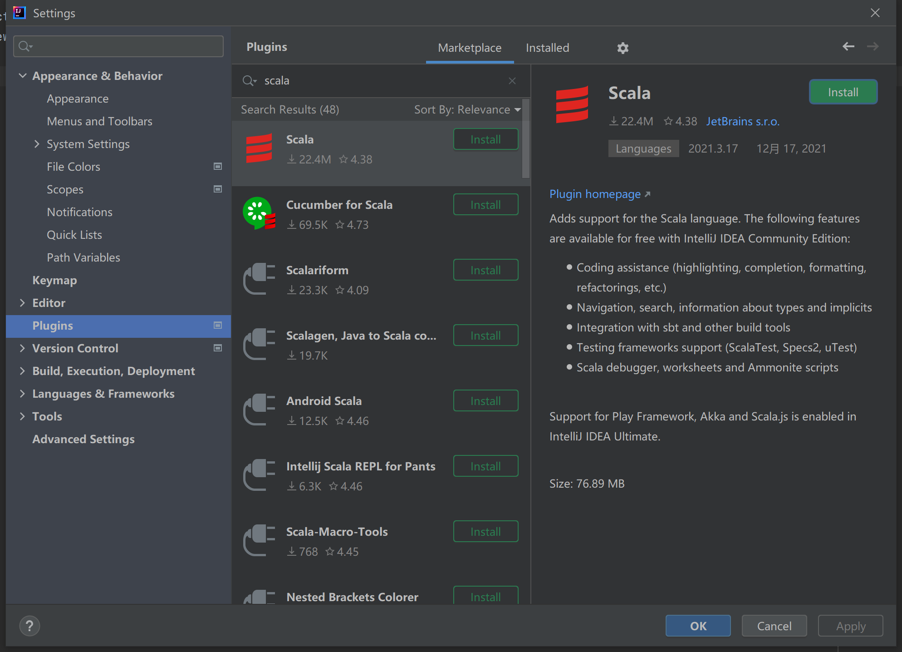
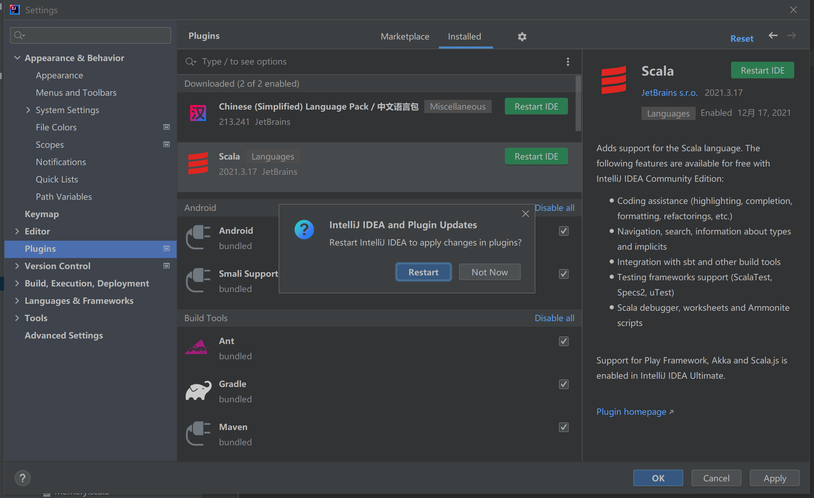
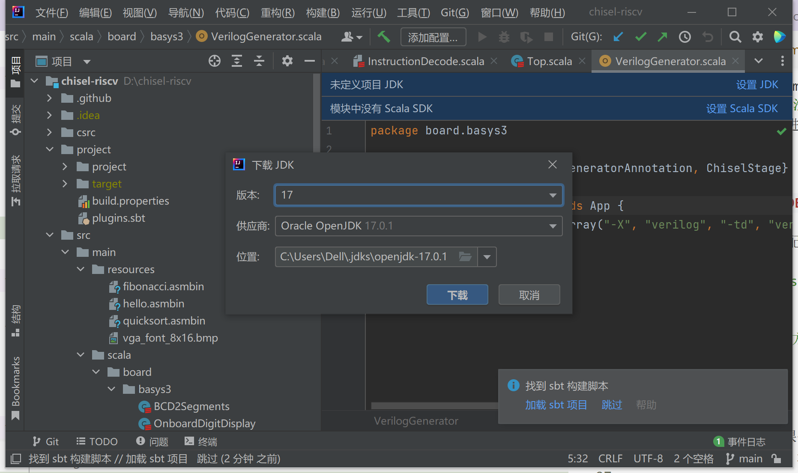
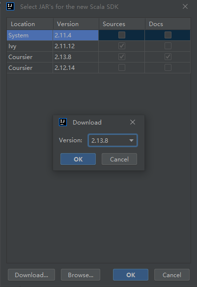

# 开发环境

By: [:material-github: wu-kan](https://github.com/wu-kan)、[:material-github: howardlau1999](https://github.com/howardlau1999)

本项目经过测试且可用的操作系统为：

- Windows 10
- Debian 11
- Debian 11, Windows Subsystem for Linux (WSL)

!!! warning "不支持 macOS"
    由于 **Vivado 无法在 macOS 上安装**，且其他工具未在 macOS 上测试过，所以如果你使用的是 macOS，请通过虚拟机或使用其他设备等方式使用上述的操作系统进行实验。

我们提供两种风格的开发环境配置方案：

1. 对于喜欢使用 IDE 集成环境的同学，推荐使用 Windows 配置方法。
2. 对于喜欢使用终端+代码编辑器组合的同学，推荐使用 Linux/WSL 配置方法。

## Windows 配置方法

### 安装 Intellij IDEA + 插件

使用 Intellij IDEA 配置开发环境比较简单，而且也经过了测试，所以，我们推荐在 Windows 上直接使用 Intellij IDEA 来设置开发环境。

可以先[安装 JetBrains Toolbox](https://www.jetbrains.com/toolbox-app/)，然后通过 JetBrains Toolbox 一键安装 Intellij IDEA Community Edition。

或者[到 JetBrains 官方网站下载 Intellij IDEA](https://www.jetbrains.com/idea/download/#section=windows)，下载免费的 Commnunity Edition 即可。

使用 Intellij IDEA 打开当前项目根目录。


按快捷键 ++ctrl+alt+s++ 打开设置。



选择 Plugins，搜索并安装 Scala 插件。



你还可以顺便安装一个中文插件。安装完成后，点击 Restart IDE 重启 IDE。


点击图上的设置 JDK，选择下载 JDK。



下载。


再选择设置 Scala SDK。


选择创建。



点下载，在跳出来的窗口中选择我们项目使用的 2.12.13 版本。

回到“添加 Scala 支持”窗口，在“使用库”中选中我们刚才下载的版本，点击确定。最后记得点击“加载 sbt 项目”加载项目配置。

大功告成！

### 安装 Vivado

中山大学组成原理实验课使用的 [Basys3](https://www.stepfpga.com/doc/_media/basys3_ss.pdf) 实验板型号为 XC7A35T，需要 Xilinx 的工具进行综合实现以及烧板。这里安装 `Vivado HL WebPACK` 即可，不需要许可或激活许可密钥。

经过测试且可用的 Vivado 版本为 2020.1。更新或更旧的版本理论上可以使用，但没有经过测试。

安装包体积较大，**推荐使用带断点续传功能的下载工具如迅雷、Free Download Manager 下载**。

如果你在**中山大学校园网内**下载 Vivado 2020.1 安装包，可以使用我们提供的镜像：<https://mirrors.matrix.moe/software/Xilinx_Unified_2020.1_0602_1208.tar>。

也可以在 Xilinx 的官网下载：<https://china.xilinx.com/support/download/index.html/content/xilinx/zh/downloadNav/vivado-design-tools/archive.html>

???+warning "预留足够的硬盘空间"
    Vivado 2020.1 安装包体积较大，约为 36 GB，且后续安装也要使用大量硬盘空间。请预留好**至少 100 GB 的硬盘空间**。

## Linux/WSL1 配置方法

下面介绍如何在 Linux 或 WSL(Windows Subsystem for Linux) 环境中搭建本实验的开发环境。[这里](https://liuhaohua.com/server-programming-guide/appendix/build-env/)给出搭建相关环境的一个参照。

这里假设你使用的 Linux 或 WSL 系统是 Debian 11。对于使用其他 Linux 系统的同学，操作是类似的，相信你有足够的能力参考下面的指令搭建环境。

### 必要工具

本实验将会使用到以下工具，除 sbt 外，可以通过下面提供的命令一键安装：

```bash
sudo apt install -y git \
    gcc-riscv64-unknown-elf \
    make \
    gnupg2 \
    scala \
    libtinfo5 \
    coreutils
```

| 名称                    | 说明                                 |
| ----------------------- | ------------------------------------ |
| git                     | 代码版本管理工具                     |
| gcc-riscv64-unknown-elf | 用于编译生成 RISC-V 可执行二进制文件 |
| make                    | 用于执行 Makefile                    |
| gnupg2                  | 签名验证工具                         |
| scala                   | 本项目的语言编译器                   |
| sbt                     | Scala 包管理器                       |
| libtinfo5               | Vivado 启动依赖                      |
| md5sum                  | 安装包校验工具                       |

### 安装 sbt 包管理器

[sbt](https://packages.debian.org/sid/sbt) 目前仍然在 Debian 的[不稳定](https://www.debian.org/releases/sid/)版本中。对于不希望使用 sid 系统的同学，可以按照[文档](https://www.scala-sbt.org/1.x/docs/zh-cn/Installing-sbt-on-Linux.html#Ubuntu%E5%92%8C%E5%85%B6%E4%BB%96%E5%9F%BA%E4%BA%8EDebian%E7%9A%84%E5%8F%91%E8%A1%8C%E7%89%88)的指示下载安装。

```bash
echo "deb https://repo.scala-sbt.org/scalasbt/debian all main" | sudo tee \
    /etc/apt/sources.list.d/sbt.list
echo "deb https://repo.scala-sbt.org/scalasbt/debian /" | sudo tee \
    /etc/apt/sources.list.d/sbt_old.list
curl -sL "https://keyserver.ubuntu.com/pks/lookup?op=get&search=0x2EE0EA64E40A89B84B2DF73499E82A75642AC823" | sudo apt-key add
sudo apt update
sudo apt install sbt
```

### 安装 Vivado

中山大学组成原理实验课使用的 [Basys3](https://www.stepfpga.com/doc/_media/basys3_ss.pdf) 实验板型号为 XC7A35T，需要 Xilinx 的工具进行综合实现以及烧板。这里安装 `Vivado HL WebPACK` 即可，不需要许可或激活许可密钥。

经过测试且可用的 Vivado 版本为 2020.1。更新或更旧的版本理论上可以使用，但没有经过测试。

中山大学校园网内下载 Vivado 2020.1 安装包，可以使用我们提供的镜像。

???+warning "预留足够的硬盘空间"
    Vivado 2020.1 安装包体积较大，约为 36 GB，且后续安装也要使用大量硬盘空间。请预留好**至少 100 GB 的硬盘空间**。

下面是使用 `curl` 下载校园网安装包镜像的命令，你也可以使用其他方式下载。

```bash
# 下载
curl -O https://mirrors.matrix.moe/software/Xilinx_Unified_2020.1_0602_1208.tar.gz
# 也可以在 Xilinx 的官网下载
# https://china.xilinx.com/support/download/index.html/content/xilinx/zh/downloadNav/vivado-design-tools/archive.html
```

由于文件较大，为了校验传输过程中是否发生错误，请在下载完成后验证安装包的 MD5 值。使用以下命令计算文件的 MD5 值：

```bash
md5sum Xilinx_Unified_2020.1_0602_1208.tar.gz
```

命令应当输出以下内容：

```bash
b018f7b331ab0446137756156ff944d9  Xilinx_Unified_2020.1_0602_1208.tar.gz
```

如果不一致，请重新下载。校验通过后，使用下面的命令解压安装包并生成安装配置文件：

```bash
tar -zxf Xilinx_Unified_2020.1_0602_1208.tar.gz
cd Xilinx_Unified_2020.1_0602_1208
./xsetup -b ConfigGen
```

先输入 `2` 再输入 `1`，这时会选中 `Vivado HL WebPACK`。最后会产生一个默认配置文件 `~/.Xilinx/install_config.txt`。

随后再次执行下述指令，安装 `Vivado HL WebPACK`。

```bash
./xsetup -a XilinxEULA,3rdPartyEULA,WebTalkTerms -b Install \
    -c ~/.Xilinx/install_config.txt -l ~/Xilinx
```

其中 `~/Xilinx` 是安装目录，可以自行定义。
