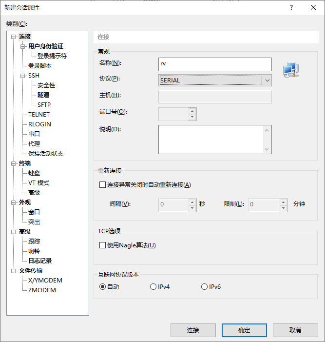
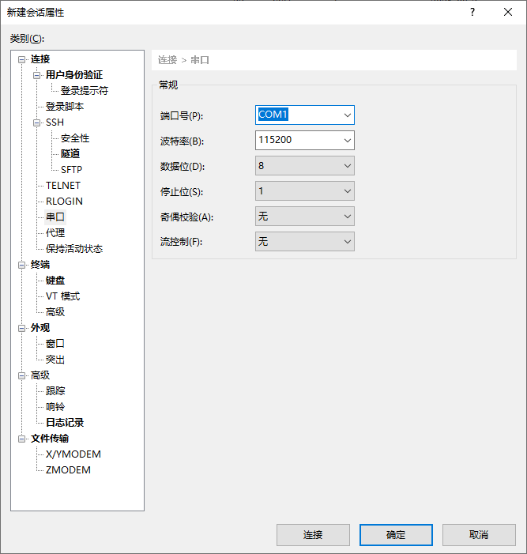
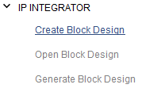
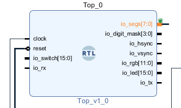
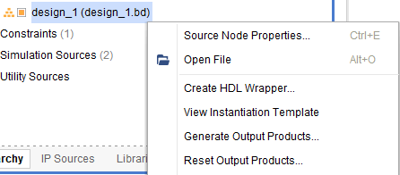
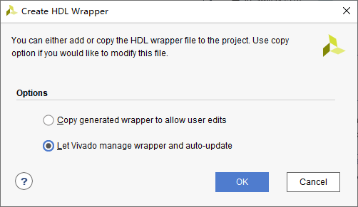

# 烧板验证

By: [:material-github: wu-kan](https://github.com/wu-kan)


## 生成 Verilog 文件

根据开发板型号，运行相应目录的 `Top.scala` 文件，生成的结果位于 `verilog/开发板名称` 目录下的 `Top.v`。

=== "命令行操作"
    ```bash
    sbt "runMain board.开发板型号.VerilogGenerator"
    ```

=== "IDEA 操作"
    打开 `src/main/scala/board/开发板型号/Top.scala`，点击 `object VerilogGenerator extends App` 一行左边的绿色三角形运行即可。

    或者可以在 "sbt shell" 窗口中，等 sbt 启动完毕后，执行 `runMain board.开发板型号.VerilogGenerator`。

## 生成比特流二进制文件

下面的教程以 `basys3` 开发板为例，其他开发板可以自行替换。

执行下述指令，可以根据 `verilog/basys3/Top.v` 生成二进制文件 `vivado/basys3/riscv-basys3/riscv-basys3.runs/impl_1/Top.bit`。

=== "Windows"
    假设你的 Vivado 安装目录是 `C:\Xilinx`（其他目录自行修改）：
    ```bash
    cd vivado\basys3
    C:\Xilinx\Vivado\2020.1\bin\vivado -mode batch -source generate_bitstream.tcl
    ```

=== "Linux"
    假设你的 Vivado 安装目录是 `~/Xilinx`（其他目录自行修改）：

    ```bash
    cd vivado/basys3
    ~/Xilinx/Vivado/2020.1/bin/vivado -mode batch \
        -source ./generate_bitstream.tcl
    ```

## 烧板

=== "Windows"
    假设你的 Vivado 安装目录是 `C:\Xilinx`（其他目录自行修改）：
    ```bash
    cd vivado\basys3
    C:\Xilinx\Vivado\2020.1\bin\vivado -mode batch -source program_device.tcl
    ```

=== "Linux"
    假设你的 Vivado 安装目录是 `~/Xilinx`（其他目录自行修改）：

    ```bash
    cd vivado/basys3
    ~/Xilinx/Vivado/2020.1/bin/vivado -mode batch \
        -source ./program_device.tcl
    ```

=== "WSL"
    由于 WSL 下可以调用 `powershell`，我们可以回到 Windows 下烧板。Windows 下可以只装 Vivado Lab，和完整版的 Vivado 相比只有烧板功能，精简很多，安装包体积约为 1 GB。

    ```bash
    # 假设你在本项目的 vivado 目录下，同时 Windows 下 Vivado Lab 2020.1 安装在 C:\Xilinx 目录下
    powershell.exe 'C:\Xilinx\Vivado_Lab\2020.1\bin\vivado_lab.bat -mode batch -source .\program_device.tcl'
    ```

后续将上述 `program_device.tcl` 换成 `generate_and_program.tcl` 可以将生成比特流和烧板在一个脚本中完成。

## 烧板结果

如果一切正常，在所有的开关处于下面的位置的时候，板上数码管应当显示 “SYSU” 的字母，如下图所示：


## 串口连接

Basys 3 的 USB 端口内置了 UART 转 USB 芯片，可以直接通过 USB 连接电脑。在完成 CPU 的 UART 中断处理后，我们可以使用串口的方式和 CPU 交互。

你可以使用任意一种串口工具，这里以 Windows 下的 Xshell 为例：

1. 打开 Xshell，点击左上角的 “新建” 按钮，新建一个会话。在“协议”中选择串口。

2. 在“串口”中选择你的串口设备，波特率选择 115200，数据位 8，停止位 1，校验位 None。端口号在每一台电脑上都不一样，如果选择之后连接不上，可以尝试其他端口。

3. 点击“确定”后，选择刚刚新建的会话，点击“连接”按钮，即可连接到 Basys 3。在通讯有数据交换的时候，USB 端口有指示灯会闪烁。

## 硬件调试

在烧板后，可能会出现硬件运行和软件模拟不一致的情况。这时候可以使用硬件调试的方式来排查问题。硬件调试需要占用一定的板上资源，使用 Vivado 提供的 Integrated Logic Analyzer（ILA）模块来实现。

在生成项目文件后，双击打开 `.xpr` 文件，启动 Vivado。在 Vivado 中，点击 "Create Block Design" 按钮，新建一个 Block Design。



然后，将 Sources 中的 Top 模块拖拽到 Block Design 中，运行 Run Block Automation 和 Run Connection Automation，将 Top 模块自动连接起来。之后，右键想要观察波形的信号，右键引脚，选择 Debug，之后再运行一次 Run Connection Automation，即可自动添加 ILA 模块并连接。



之后右键 Sources 中的 Block Design，运行 Create HDL Wrapper，创建好对应的顶层模块后，按照正常流程生成比特流并烧入到开发板上。





之后确保 Hardware Manager 中能够看到 Debug 核，就可以使用 Vivado 的硬件调试功能捕获实际运行的波形了。