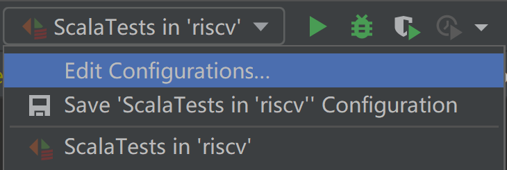
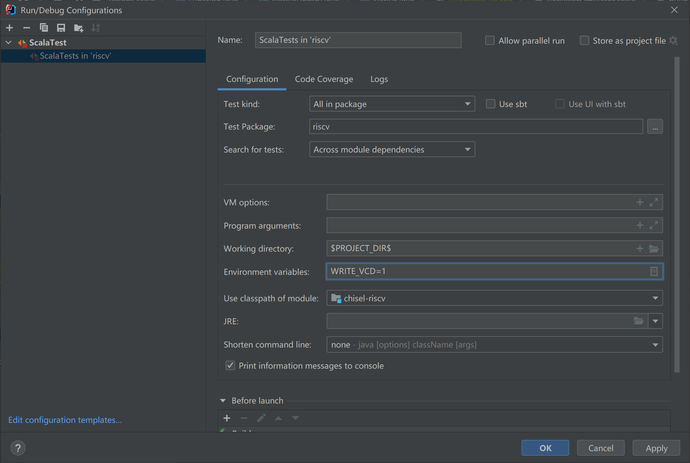
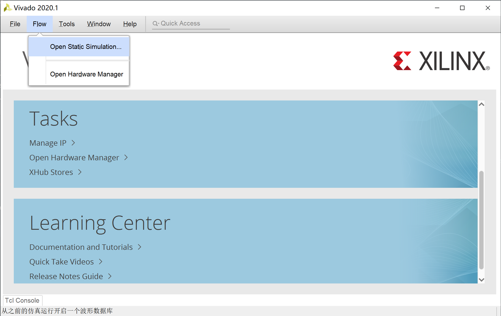
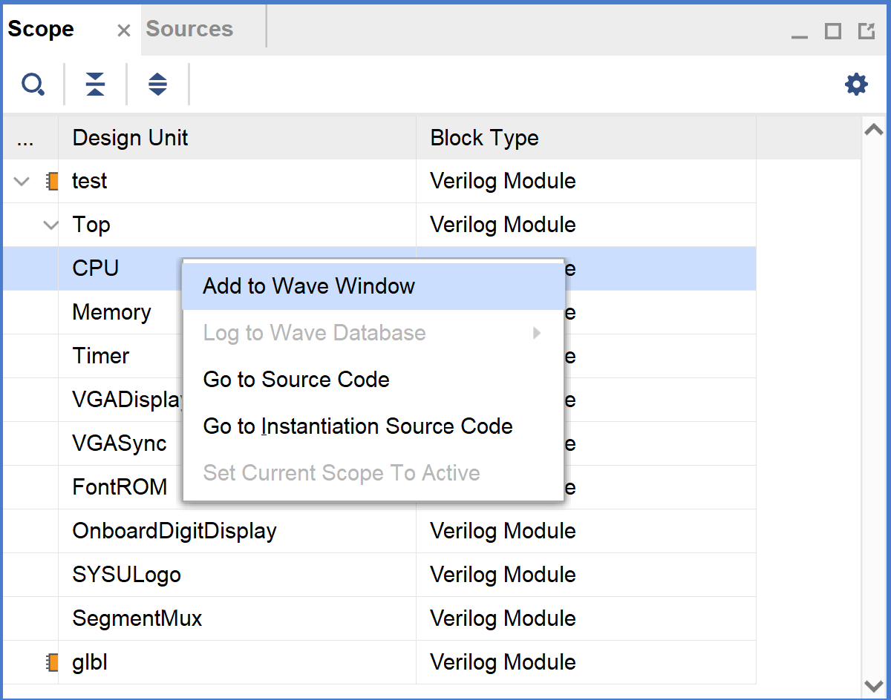

# 波形仿真

By: [:material-github: howardlau1999](https://github.com/howardlau1999)

在烧板验证之前，可以使用波形仿真再进行一次测试。你可以使用 Vivado 或者 Verilator 进行波形仿真。使用 Verilator 仿真需要安装 C++ 编译器。

## 生成波形文件

### 测试时生成波形文件

在运行测试时，如果设置环境变量 `WRITE_VCD` 为 `1`，则会生成波形文件。

=== "Linux/macOS"
    ```bash
    WRITE_VCD=1 sbt test
    ```

=== "Windows"
    Powershell:
    ```powershell
    $Env:WRITE_VCD=1; sbt test
    ```
    命令提示符:
    ```cmd
    set WRITE_VCD=1
    sbt test
    ```

=== "Intellij IDEA"
    先点击右上角三角形左边的下拉菜单，点 “Edit configurations...”，如果没有就先运行一次测试。 
    
    在 “Environment Variables” 选项中，添加一个环境变量，名称为 `WRITE_VCD`，值为 `1`。
    
    之后点 OK 保存即可。

之后可以在 `test_run_dir` 目录下的各个子目录中找到 `.vcd` 文件，使用 GTKWave 打开即可，参考[查看波形文件](#查看波形文件)一节。

### 使用 Verilator 仿真生成波形文件

如果想快速测试自己编写的程序，可以使用 Verilator 进行仿真，仿真的主函数已经写好，位于 `verilog/verilator/sim_main.cpp`。在第一次运行以及每次修改了 Chisel 3 代码后，需要在项目根目录执行命令生成 Verilog 文件：

```bash
sbt "runMain board.verilator.VerilogGenerator"
```

之后，进入 `verilog/verilator` 目录，执行以下命令生成仿真程序：

=== "Linux/macOS"
    ```bash
    verilator --cc --exe --trace --build Top.v sim_main.cpp
    ```
    或
    ```bash
    verilator --cc --exe --trace Top.v sim_main.cpp
    make -C obj_dir -f VTop.mk
    ```

=== "Windows"
    ```bash
    verilator_bin --cc --exe --trace --build Top.v sim_main.cpp
    ```
    或
    ```bash
    verilator_bin --cc --exe --trace Top.v sim_main.cpp
    make -C obj_dir -f VTop.mk
    ```

编译完成后，会生成 `obj_dir/VTop` （Windows 下为 `obj_dir/VTop.exe`）的可执行文件。该可执行文件可以传入参数从而运行不同的代码文件。参数以及其用法如下：

|参数|用法|
|----|-----|
|`-memory`|指定仿真内存的大小，单位为字（4字节）。用例：`-memory 4096`|
|`-instruction`|指定用于初始化仿真内存的 RISC-V 程序。用例：`-instruction ~/yatcpu/src/main/resources/hello.asmbin`|
|`-signature`|指定仿真结束后，需要输出的内存范围以及目的文件。用例：`-signature 0x100 0x200 mem.txt`|
|`-halt`|指定停机标识符地址，往该内存地址写入 `0xBABECAFE` 即停止仿真。用例：`-halt 0x8000`|
|`-vcd`|指定仿真过程波形保存的文件名，不指定则不会生成波形文件。用例：`-vcd dump.vcd`|
|`-time`|指定最大仿真时间，注意时间是周期数的两倍。用例：`-time 1000`|

例如，如果想加载 `hello.asmbin` 文件，仿真 1000 个周期，并将仿真波形保存到 `dump.vcd` 文件，可以运行：

```bash
obj_dir/VTop -instruction ~/yatcpu/src/main/resources/hello.asmbin \
-time 2000 -vcd dump.vcd
```

另外，使用 Verilator 仿真时，向内存地址 `0x40000010`（也即 UART 的 MMIO 地址）写入的数据将转换为字符输出到标准输出，可以用来实现 `printf` 等功能，方便调试。 

### 使用 Vivado 仿真生成波形文件

确保你的 PATH 路径中包含 Vivado 的安装目录，然后运行命令：

```bash
make vivado-sim
```

将会生成 `vivado/riscv-basys3/riscv-basys3.sim/sim_1/behav/xsim/dump.vcd` 文件。

## 查看波形文件
### 使用 GTKWave 查看 VCD 格式波形

不同软件生成的 VCD 文件路径不一样：

- Vivado: `vivado/riscv-basys3/riscv-basys3.sim/sim_1/behav/xsim/dump.vcd`
- 测试时生成：`test_run_dir` 目录下的各个子目录中的 `.vcd` 文件

如果你的操作系统带有 GUI 图形界面，可以使用 [GTKWave](http://gtkwave.sourceforge.net/)，点击 "File->Open New Tab..." 打开对应的文件查看波形。


### 使用 Vivado 查看 WDB 格式波形

你也可以打开 Vivado 来查看波形，Vivado 支持的格式为 `.wdb`，路径是 `vivado/riscv-basys3/riscv-basys3.sim/sim_1/behav/xsim/test_behav.wdb`。在启动 Vivado 后，选择菜单栏的 "Flow->Open Static Simulation..."，选择这个文件，然后点击 "Open" 按钮。




打开后，在左侧的窗口找到你感兴趣的模块，右键，选择 "Add to Wave Window"，即可在波形窗口查看波形。



