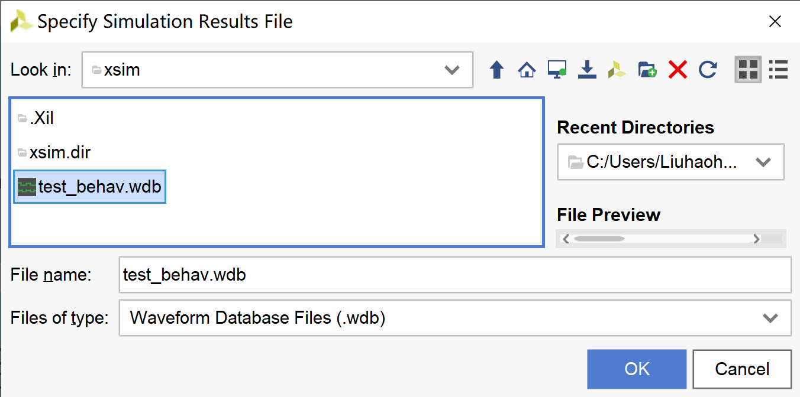

# 波形仿真

By: [:material-github: howardlau1999](https://github.com/howardlau1999)

在烧板验证之前，可以使用波形仿真再进行一次测试。你可以使用 Vivado 或者 Verilator 进行波形仿真。使用 Verilator 仿真需要安装 C++ 编译器。

## 生成波形文件

### 使用 Verilator 仿真生成波形文件

按照[安装指南](https://veripool.org/guide/latest/install.html)，安装 Verilator 并设置环境变量。然后在项目根目录下执行：

```bash
make verilator-sim
```

即可编译并运行 Verilator 仿真。你可以通过 `SIM_TIME` 变量设置仿真运行的时间：

```bash
SIM_TIME=10000 make verilator-sim
```

运行命令后，将会生成 `verilog/verilator/obj_dir/sim.vcd` 文件。

### 使用 Vivado 仿真生成波形文件

确保你的 PATH 路径中包含 Vivado 的安装目录，然后运行命令：

```bash
make vivado-sim
```

将会生成 `vivado/riscv-basys3/riscv-basys3.sim/sim_1/behav/xsim/dump.vcd` 文件。

## 查看波形文件
### 使用 GTKWave 查看 VCD 格式波形

不同软件生成的 VCD 文件路径不一样：

- Vivado: `vivado/riscv-basys3/riscv-basys3.sim/sim_1/behav/xsim/dump.vcd`
- Verilator: `verilog/verilator/obj_dir/sim.vcd`

如果你的操作系统带有 GUI 图形界面，可以使用 [GTKWave](http://gtkwave.sourceforge.net/)，点击 "File->Open New Tab..." 打开对应的文件查看波形。


### 使用 Vivado 查看 WDB 格式波形

你也可以打开 Vivado 来查看波形，Vivado 支持的格式为 `.wdb`，路径是 `vivado/riscv-basys3/riscv-basys3.sim/sim_1/behav/xsim/test_behav.wdb`。在启动 Vivado 后，选择菜单栏的 "Flow->Open Static Simulation..."，选择这个文件，然后点击 "Open" 按钮。




打开后，在左侧的窗口找到你感兴趣的模块，右键，选择 "Add to Wave Window"，即可在波形窗口查看波形。


