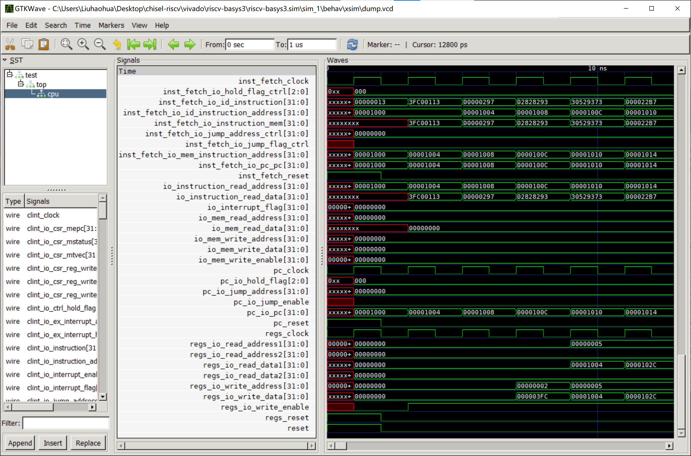

# 波形仿真

By: [:material-github: howardlau1999](https://github.com/howardlau1999)

在烧板验证之前，可以使用波形仿真再进行一次测试。

## 生成波形文件

假设你的 Vivado 安装目录是 `~/Xilinx`（其他目录自行修改），运行以下命令运行仿真并生成 `.vcd` 格式的波形文件：

```bash
cd vivado
~/Xilinx/Vivado/2020.1/bin/vivado -mode batch \
    -source ./run_simulation.tcl
```

## 使用 GTKWave 查看 VCD 格式波形

执行完成后，应该会生成 `vivado/riscv-basys3/riscv-basys3.sim/sim_1/behav/xsim/dump.vcd` 波形文件。如果你的操作系统带有 GUI 图形界面，可以使用 [GTKWave](http://gtkwave.sourceforge.net/)，点击 "File->Open New Tab..." 打开这个文件查看波形。



## 使用 Vivado 查看 WDB 格式波形

你也可以打开 Vivado 来查看波形，Vivado 支持的格式为 `.wdb`，路径是 `vivado/riscv-basys3/riscv-basys3.sim/sim_1/behav/xsim/test_behav.wdb`。在启动 Vivado 后，选择菜单栏的 "Flow->Open Static Simulation..."，选择这个文件，然后点击 "Open" 按钮。


打开后，在左侧的窗口找到你感兴趣的模块，右键，选择 "Add to Wave Window"，即可在波形窗口查看波形。


